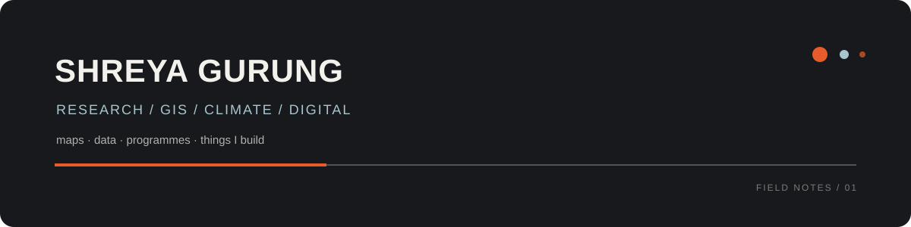

  

  <a href="https://www.linkedin.com/in/shreya-gurung-b42664132/">LinkedIn</a>
  &nbsp; · &nbsp;
  <a href="mailto:shreyagurung07@gmail.com">Email</a>

I work across climate, environmental research, GIS and digital projects.

I like working where data, fieldwork and technology meet.

---

## Selected work

### 01 / GIS + Research

Maps, spatial analysis and environmental research.

`ArcGIS` `QGIS` `Google Earth Engine` `Remote Sensing`

### 02 / Climate + Environment

Projects around climate action, waste, ecological systems and community programmes.

`Climate` `Environment` `Zero Waste` `Programme Design`

### 03 / Digital projects

Websites, CMS projects, digital archives and things I build.

`React` `TypeScript` `Supabase` `GitHub`

---

## A few things I've built

[Daara Pari](https://github.com/shreyagurung/daara-pari)  
Website and digital experience for a Himalayan homestay.

[Rahul Gautam](https://github.com/shreyagurung/rahul-gautam-lets-build-v3)  
Digital portfolio and website project.

More projects are being added as I organise my work.

---

## Tools I use

GIS  
`ArcGIS` `QGIS` `Google Earth Engine`

Data  
`Python` `R` `Excel`

Web  
`HTML` `CSS` `JavaScript` `React` `TypeScript`

Digital  
`Git` `GitHub` `Supabase` `Notion` `Canva`

---

## Background

MSc Disaster Management, Tata Institute of Social Sciences  
B.Tech Information Technology, Christ University

My work has moved between environmental research, climate programmes,
community work, fundraising, communication and technology.

---

## Currently exploring

GIS and environmental data  
AI-assisted research and workflows  
Digital archives and websites  
Climate and disaster resilience

---

  research · maps · data · making

