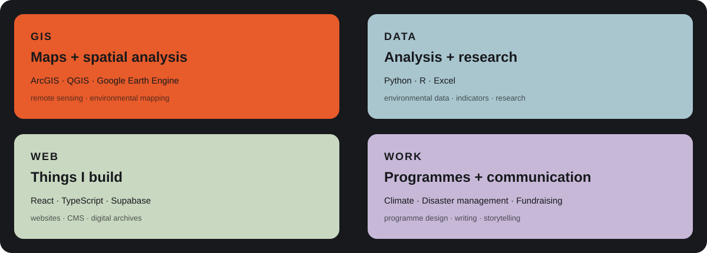

  

  <a href="https://www.linkedin.com/in/shreya-gurung-b42664132/">LinkedIn</a>
  &nbsp; · &nbsp;
  <a href="mailto:shreyagurung07@gmail.com">Email</a>

I work across climate, environmental research, GIS and digital projects.

I like working where data, fieldwork and technology meet.

---

## Selected work

### GIS + Research

Maps, spatial analysis and environmental research around climate,
disasters and environmental change.

### Climate + Environment

Projects around climate action, waste, ecological systems and
community programmes.

### Digital projects

Websites, CMS projects, digital archives and other things I build.

---

  

---

## A few things I've built

[Daara Pari](https://github.com/shreyagurung/daara-pari)  
Website and digital experience for a Himalayan homestay.

[Rahul Gautam](https://github.com/shreyagurung/rahul-gautam-lets-build-v3)  
Digital portfolio and website project.

More projects will find their way here as I organise my work.

---

## Background

MSc Disaster Management, Tata Institute of Social Sciences  
B.Tech Information Technology, Christ University

My work has moved between environmental research, climate programmes,
community work, fundraising, communication and technology.

---

  research · maps · data · making

